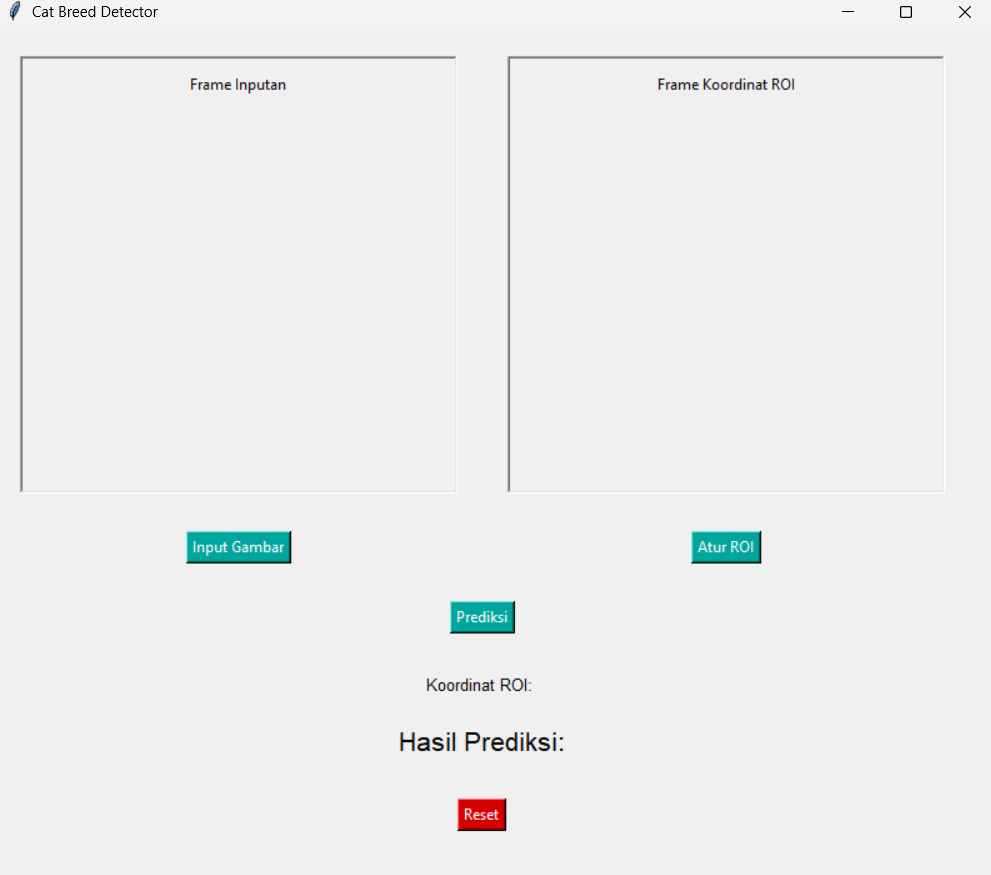
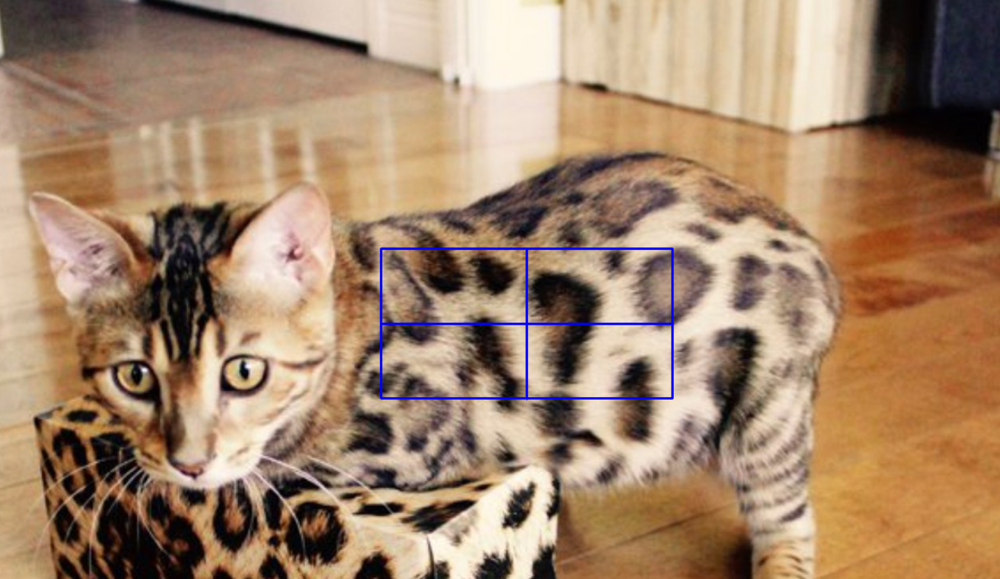
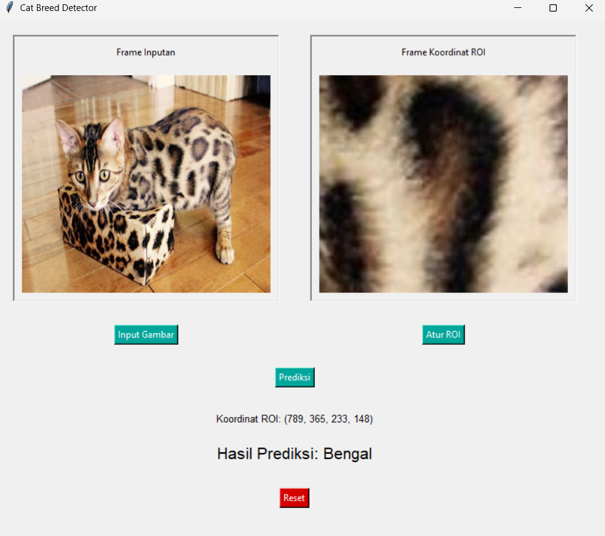

## About This Project

 

A simple Cat Breed Detector made with python using KNN

Supported Cat Breed:

- Bengal
- Ragdol
- Maine Coon
- Spynx
- American Bobtail

## How to Use

- Open the <strong>_CatBreedDetector.py_</strong> and install all the necessary library via pip.

- Run the <strong>_CatBreedDetector.py_</strong>.

- Input the image of the cat you want to identify using the button "Input Gambar".

- Using the button "Atur ROI", select the area of the cat fur pattern and click enter.

- Click "Prediksi" and your cat image will be identified.

- If you want to do another identifying, click "Reset".
